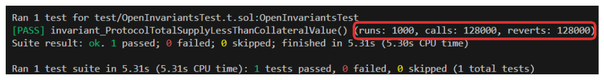
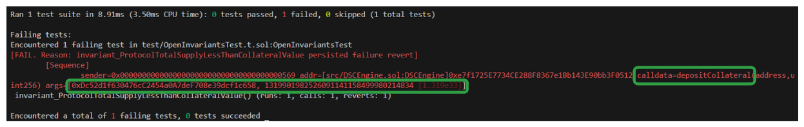
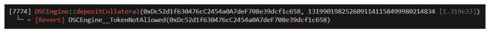

# Project: Stablecoin Protocol

stablecoin is going to be:

1. Relative Stability: Anchored or Pegged to the US Dollar

   a. Chainlink Pricefeed

   b. Function to convert ETH & BTC to USD

2. Stability Mechanism (Minting/Burning): Algorithmicly Decentralized

   a. Users may only mint the stablecoin with enough collateral

3. Collateral: Exogenous (Crypto)

   a. wETH

   b. wBTC

The Decentralized Stablecoin protocol has 2 contracts at it's heart.

* **DecentralizedStableCoin.sol**

* **DSCEngine.sol**

DecentralizedStableCoin.sol is effectively a fairly simple ERC20 with a few more advanced features imported such as [ERC20Burnable](https://github.com/OpenZeppelin/openzeppelin-contracts/blob/master/contracts/token/ERC20/extensions/ERC20Burnable.sol) and OpenZeppelin's [Ownable](https://github.com/OpenZeppelin/openzeppelin-contracts/blob/master/contracts/access/Ownable.sol) libraries.  

The real meat of this protocol can be found in DSCEngine.sol. DecentralizeStableCoin.sol is ultimately going to be controlled by this DSCEngine and most of the protocol's complex functionality is included within including functions such as:

* **depositCollateralAndMintDsc**

* **redeemCollateral**

* **burn**

* **liquidate**  


... and much more.  

In addition to all the source contracts, this protocol comes with a full test suite including `unit`, `fuzz` and `invariant` tests.

## Fuzz Testing
The first thing we want to do to prepare our stateful fuzzing suite is to configure some of the fuzzer options in our foundry.toml.  

```Toml
[invariant]
runs = 128
depth = 128
fail_on_revert = false
```
Adding the above to our foundry.toml will configure our fuzz tests to attempt `128 runs` and make `128 calls` in each run (depth).

Next, create the directory test/fuzz. We'll need to create 2 files within this folder, `InvariantsTest.t.sol` and `Handler.t.sol`.

`InvariantsTest.t.sol` will ultimately hold the tests and the invariants that we assert, while the handler will determine how the protocol functions are called. for example in this StableCoin project, if our fuzzer makes a call to `depositCollateral` without having _minted any collateral_, it's kind of a wasted run. We can filter these with an adequate handler configuration.  

Before writing a single line of our invariant tests we need to ask the question:

*What are the invariants of my protocol?*  
We need to ascertain which properties of our system must always hold.
What are some for DecentralizedStableCoin?

1. The total supply of DSC should be less than the total value of collateral
2. Getter view functions should never revert

### [OpenInvariantTest.t.sol](https://github.com/AkshatOdiya/foundry-defi-stabelcoin/blob/main/test/fuzz/OpenInvariantsTest.t.sol)

```solidity
// SPDX-License-Identifier: MIT
​
pragma solidity 0.8.18;
​
import {Test} from "forge-std/Test.sol";
import {StdInvariant} from "forge-std/StdInvariant.sol";
​
contract InvariantsTest is StdInvariant, Test {}
```
StdInvariant is quite important for our purposes, this is where we derive the ability to set a targetContract which we point to our Handler.

Begin with a setUp function. In this setUp we'll perform our usual deployments of our needed contracts via our deployment script. We'll import our HelperConfig as well.

```solidity
// SPDX-License-Identifier: MIT
​
pragma solidity 0.8.18;
​
import {Test} from "forge-std/Test.sol";
import {StdInvariant} from "forge-std/StdInvariant.sol";
import {DeployDSC} from "../../script/DeployDSC.s.sol";
import {DSCEngine} from "../../src/DSCEngine.sol";
import {DecentralizedStableCoin} from "../../src/DecentralizedStableCoin.sol";
import {IERC20} from "@openzeppelin/contracts/token/ERC20/IERC20.sol";
import {HelperConfig} from "../../script/HelperConfig.s.sol";
​
contract InvariantsTest is StdInvariant, Test {
     DeployDSC deployer;
    DSCEngine dsce;
    DecentralizedStableCoin dsc;
    HelperConfig config;
    address weth;
    address wbtc;
​
    function setUp() external {
        deployer = new DeployDSC();
        (dsc, dsce, config) = deployer.run();
        (,,weth, wbtc, ) = config.activeNetworkConfig();
        targetContract(address(dsce));
    }
    function invariant_protocolMustHaveMoreValueThanTotalSupply() public view {
    uint256 totalSupply = dsc.totalSupply();
    uint256 totalWethDeposited = IERC20(weth).balanceOf(address(dsce));
    uint256 totalWbtcDeposited = IERC20(wbtc).balanceOf(address(dsce));
​
    uint256 wethValue = dsce.getUsdValue(weth, totalWethDeposited);
    uint256 wbtcValue = dsce.getUsdValue(wbtc, totalWbtcDeposited);

    // Assertion
    assert(wethValue + wbtcValue >= totalSupply);
}
}
```
For Open testing methodology, we can simply skip `handler`,just set the targetContract to DSCEngine (dsce), and then declare an invariant in our test function.

Now Running

```bash
forge test --mt invariant_protocolMustHaveMoreValueThanTotalSupply -vvvv
```
Let us increase the to `1000 runs`

    

In the image above, notice how many calls were made vs how many times a function call reverted. Every single call is reverting! This in essence means that our test wasn't able to do anything. This is not a very reassuring test.

The reason our test is still passing, despite all these reverts is related to the `fail_on_revert` in foundry.toml. If it is adjusted to `true` we'll see that our test fails right away.  

*Why are all the calls reverting?*

Without any guidance, Foundry is going to throw truly random data at the function calls. For example `depositCollateral` function is only configured to accept the two authorized tokens for our protocol, wbtc and weth, the fuzzer could be calling this function with thousands of invalid addresses.

`fail_on_revert` can be great for quick testing and keeping things simple, but it can be difficult to narrow the validity of runs when this is set to false.

Let's set this option to `true` and run test once more.  

  

It can be seen that first function being called by the fuzzer is `depositCollateral` and its passing a random tokenAddress argument causing revert immediately.

 

### [HandlerInvariantTest.t.sol](https://github.com/AkshatOdiya/foundry-defi-stabelcoin/blob/main/test/fuzz/HandlerInvariantTests.t.sol) and [Handler.t.sol](https://github.com/AkshatOdiya/foundry-defi-stabelcoin/blob/main/test/fuzz/Handler.t.sol)  

Instead of having target as DSCEngine, move target contract to `Handler.t.sol`. In this contract we can structure our function calls so that fuzzing is not unnecessarrily random. 
Like it is irrelevant to call redeemCollateral before depositing collateral.

---

## References:
1. Concept of [healt factor](https://aave.com/help/borrowing/liquidations) is taken from aave protocol.